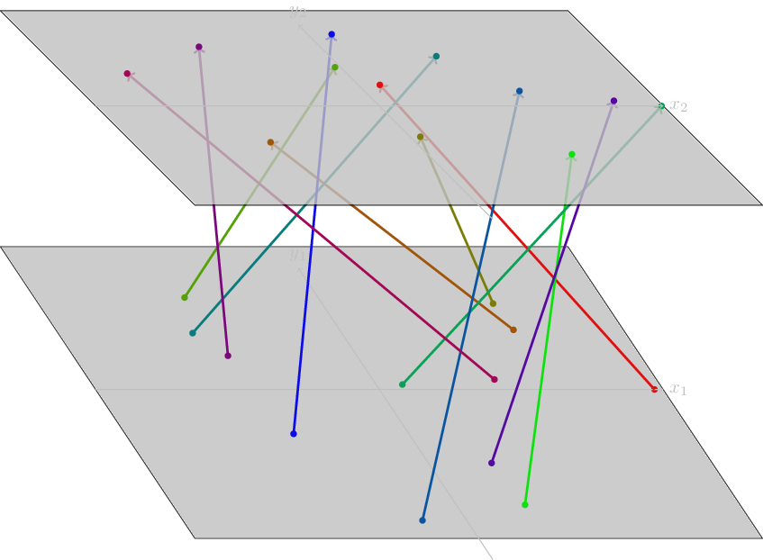

design-finder
=============

A collection of utilities to generate spherical (_t_,_t_)-designs (henceforth, _t_-designs) in **C**^d with given parameters.

This software was written by me under the supervision of [Shayne Waldron](https://www.math.auckland.ac.nz/~waldron/).


_A spherical (3,3)-design of 157 vectors in **C**^5_


Requirements
------------

  * MATLAB (at least R2018b).
  * To use the Manopt scripts, you will need the [Manopt](https://manopt.org/) software package installed somewhere in the MATLAB
    path.

For the Python utilities, you also need:
  * Python 3._x_, where _x_ is a version [supported](https://au.mathworks.com/help/matlab/matlab_external/system-requirements-for-matlab-engine-for-python.html) by
    the [MATLAB API for Python](https://au.mathworks.com/help/matlab/matlab-engine-for-python.html)  (for Python utility only).
  * The MATLAB API for Python itself ([installation instructions](https://au.mathworks.com/help/matlab/matlab_external/install-the-matlab-engine-for-python.html)). This comes with MATLAB,
    it just needs to be manually enabled.

Scripts included
----------------

### MATLAB scripts and functions
The following MATLAB scripts may be used by modifying the parameters at the top of each file.

  * `runtf.m`, which tries to generate a _t_-design with given fixed parameters.
  * `runtfMO.m`, the same as `runtf.m` but using Manopt.
  * `search_designs.m`, which tries to find a _t_-design for *lots* of _n_, given
    a fixed _d_ and _t_.
  * `search_designsMO.m`, the same as `search_designs.m` but using Manopt.
  * `exp12.m`, which takes an existing design generated by `runtf.m` and makes it better.
  * `countDesigns.m`, which counts projective unitary equivalence classes of (d,n,t)-designs
    by computing triple products (see [2] sec. 8.2). This uses Manopt.
  * `tabulate.m`, which  calculates **all**(!) minimal designs (table 6.2 of [2]) until the end of time.

For the more technical user, here are the functions and objects that you can call and use from your own scripts. The three scripts
listed above should be decent examples of the usage of these utilities.

  * `DesignPotential` is an object representing an error function and the gradient of that function, for use in computations.
    One example is `ComplexDesignPotential` (which deals with the complex case).
  * `getRandomComplexSeed` generates a good starting matrix for iteration.
  * `iterateOnDesign` takes a starting matrix and a `DesignPotential` instance and tries to iterate it to compute
    a better design.
  * `iterateOnDesignMO` is the Manopt version of `iterateOnDesign`. To pick a starting matrix automatically, set the initial
    parameter `A` to be an `NaN` matrix of the correct dimensions.
  * `compute3Products` takes a design and returns the list of its 3-products in ascending order.
  * `guessOrderLowerBound`, which uses results of [1] to bound below the sizes of possible designs.


Remarks.

  * Designs are always stored as _d_ by _n_ matrices.
  * `runtf.m` and `exp12.m` will both produce a file in the current directory, named like `tf_run_YYYY_MM_DD_hh_mm_ss.mat`, containing all the data used
    to generate the design, as well as the design itself, and a list of the error of the design produced at each iteration. `search_designs.m` will produce
    a whole *directory* (in the current directory), named like `search_designs_D_T_YYYY_MM_DD_hh_mm_ss/`, which contains `.mat` files like those generated
    by `runtf.m` (named according to _n_) and plots of the associated errors.
  * `runtf.m` takes an `errorMultiplier` parameter (the step size at each iteration is then `errorMultiplier * (error)^errorExp`); this needs to be chosen
    by the user for a given _d_,_n_,_t_ triple and can be fiddly to do. An example of an automated method, which seems to work reasonably well, may be found
    in `search_designs.m` (in particular, the for loop on `r_try`).

### Python scripts
The Python scripts accept a `--help` argument. Here is a list of the scripts.

  * `generate_runtf.py`, which takes a directory of output files from the MATLAB scripts and produces a standalone directory containing an HTML index file to all of them.
  * `generate_from_search.py`, which takes a *single* output directory from `search_designs.m` and produces a nice HTML rendering (for certain values of 'nice').
  * `fmagma.py`, which takes a single `.mat` file and produces a `.magma` file containing the same design.
  * `project.py`, which takes a single `.mat` file and produces a simple LaTeX/TiKZ visualisation. There are a number of configuration options; the image below
    was produced from a design with parameters (_d_,_n_,_t_) = (2,12,4) by running the following command in `examples`:
```
python3.7 ../project.py 2_12_4.mat -arif -o 2_12_4.tex && pdflatex 2_12_4 && convert 2_12_4.pdf 2_12_4.png
```


  * `project3d.py`, which takes a single `.mat` file and produces a 3D version of the `project.py` LaTeX/TiKZ visualisation. The image below
    was produced from a design with parameters (_d_,_n_,_t_) = (2,12,4) by running the following command in `examples`:
```
python3.7 ../project3d.py 2_12_4.mat -o 2_12_4_3D.tex -ee && pdflatex 2_12_4_3D && convert -flatten -density 150 2_12_4_3D.pdf -quality 100 2_12_4_3D.png
```



References
----------

  1. **Delsarte, P.; Goethals, J. M.; Seidel, J. J.** Spherical codes and designs. _Geometriae Dedicata_ 6 (1977), no. 3, 363–388. [MR485471](http://www.ams.org/mathscinet-getitem?mr=485471).
  2. **Waldron, Shayne F. D.** An introduction to finite tight frames. Applied and Numerical Harmonic Analysis. _Birkhäuser/Springer, New York_, 2018. xx+587 pp. ISBN: 978-0-8176-4814-5; 978-0-8176-4815-2. [MR3752185](http://www.ams.org/mathscinet-getitem?mr=3752185). See in particular chapter 6.
